# RedOps Vault

Self-hosted engagement tracker for red team operators. Centralizes what a
team collects during an assessment — encrypted loot and credentials,
infrastructure/network mapping, ATT&CK-mapped findings, and kill chain
activity (Lockheed Martin or Unified Kill Chain) — and exports a
client-ready report. Engagements move through a Kanban board (Backlog →
Planning → Active → Completed); access is role-based (`operator` full
access, `admin` also manages users).

No CDN dependencies, no telemetry. Built with Flask, Postgres, and
Bootstrap 5.

## Screenshots

<table>
<tr>
<td width="50%">
<strong>Engagements board</strong><br>
<a href="docs/screenshots/engagements-board.png">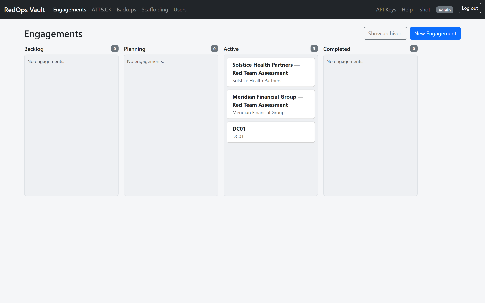</a>
</td>
<td width="50%">
<strong>Engagement overview</strong><br>
<a href="docs/screenshots/engagement-overview.png">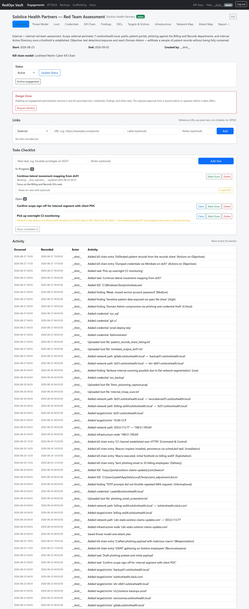</a>
</td>
</tr>
<tr>
<td width="50%">
<strong>Kill chain timeline</strong><br>
<a href="docs/screenshots/killchain.png">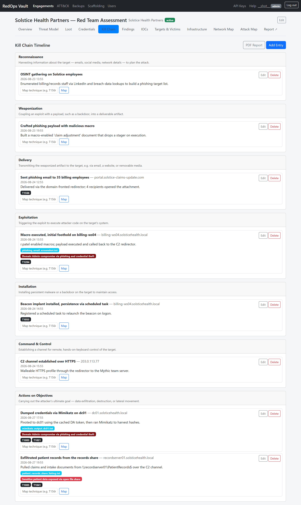</a>
</td>
<td width="50%">
<strong>Attack map</strong> — replays the kill chain across target infrastructure<br>
<a href="docs/screenshots/attack-map.png">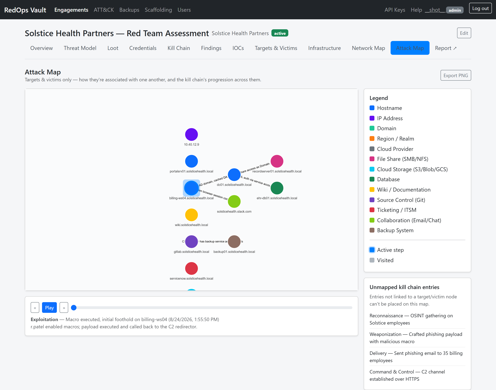</a>
</td>
</tr>
<tr>
<td width="50%">
<strong>Findings</strong><br>
<a href="docs/screenshots/findings.png">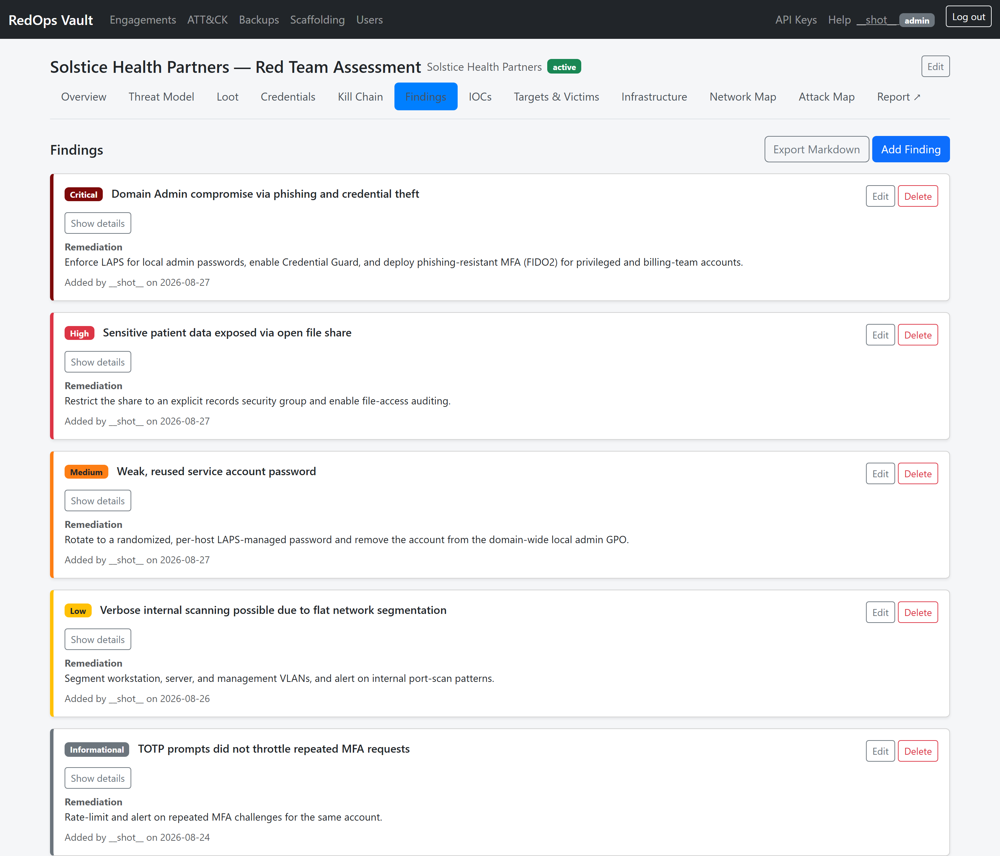</a>
</td>
<td width="50%">
<strong>Credentials</strong> — with live TOTP codes<br>
<a href="docs/screenshots/credentials.png">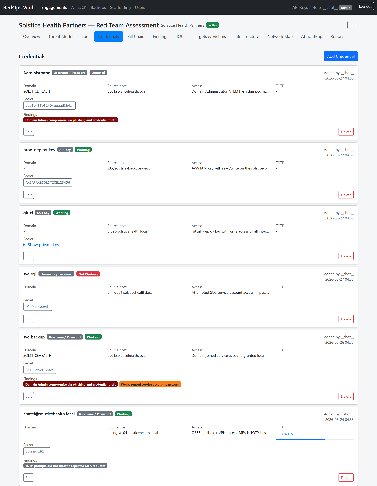</a>
</td>
</tr>
<tr>
<td width="50%">
<strong>Targets &amp; victims</strong><br>
<a href="docs/screenshots/targets.png">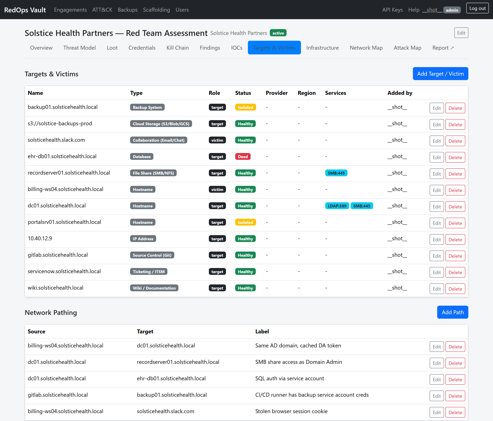</a>
</td>
<td width="50%">
<strong>ATT&amp;CK matrix</strong> — live-synced from MITRE<br>
<a href="docs/screenshots/attack-matrix.png">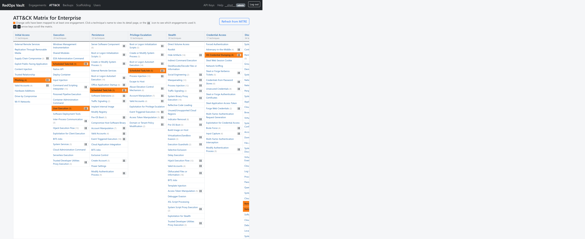</a>
</td>
</tr>
<tr>
<td width="50%">
<strong>Kill chain report</strong> — client-ready HTML/PDF export<br>
<a href="docs/screenshots/killchain-report.png">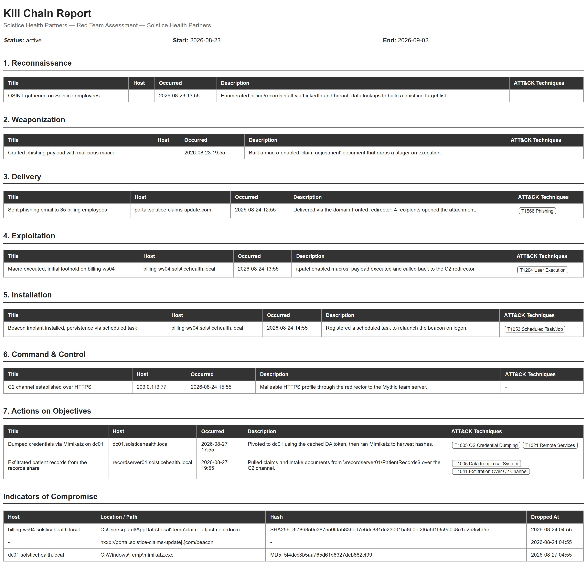</a>
</td>
<td width="50%">
<strong>Threat model &amp; attack plan</strong><br>
<a href="docs/screenshots/threat-model.png">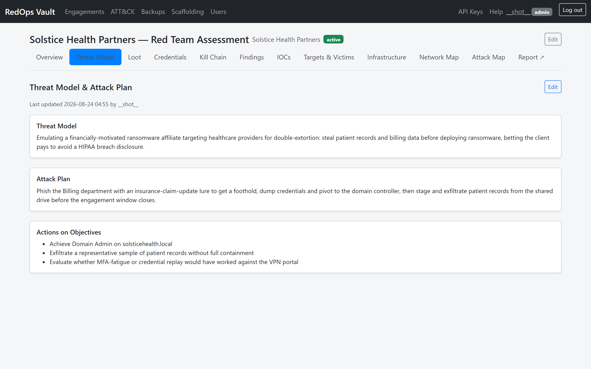</a>
</td>
</tr>
<tr>
<td width="50%">
<strong>Loot</strong> — encrypted file storage<br>
<a href="docs/screenshots/loot.png">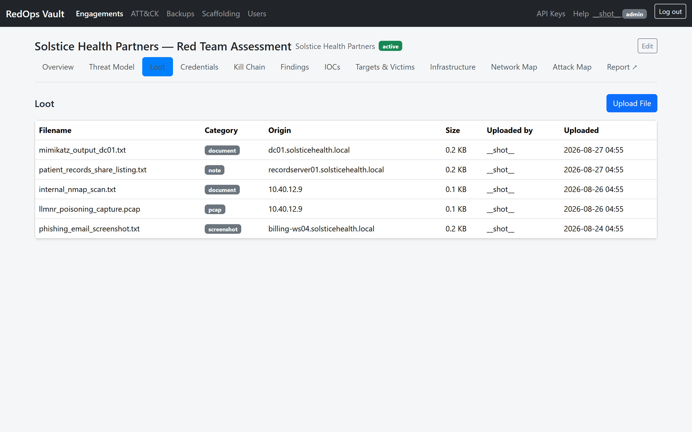</a>
</td>
<td width="50%">
<strong>IOCs</strong><br>
<a href="docs/screenshots/iocs.png">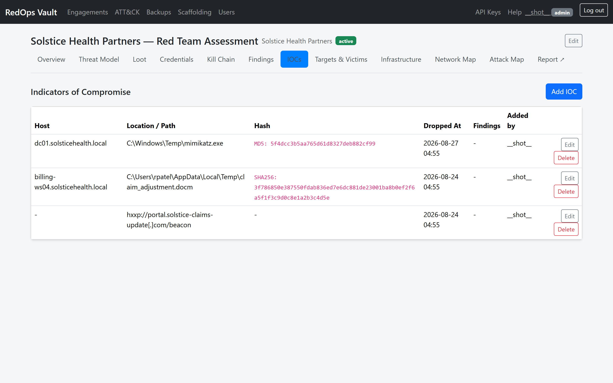</a>
</td>
</tr>
<tr>
<td width="50%">
<strong>Agent scaffolding</strong> — ready-to-paste system prompt for an AI agent to drive an engagement<br>
<a href="docs/screenshots/scaffolding.png">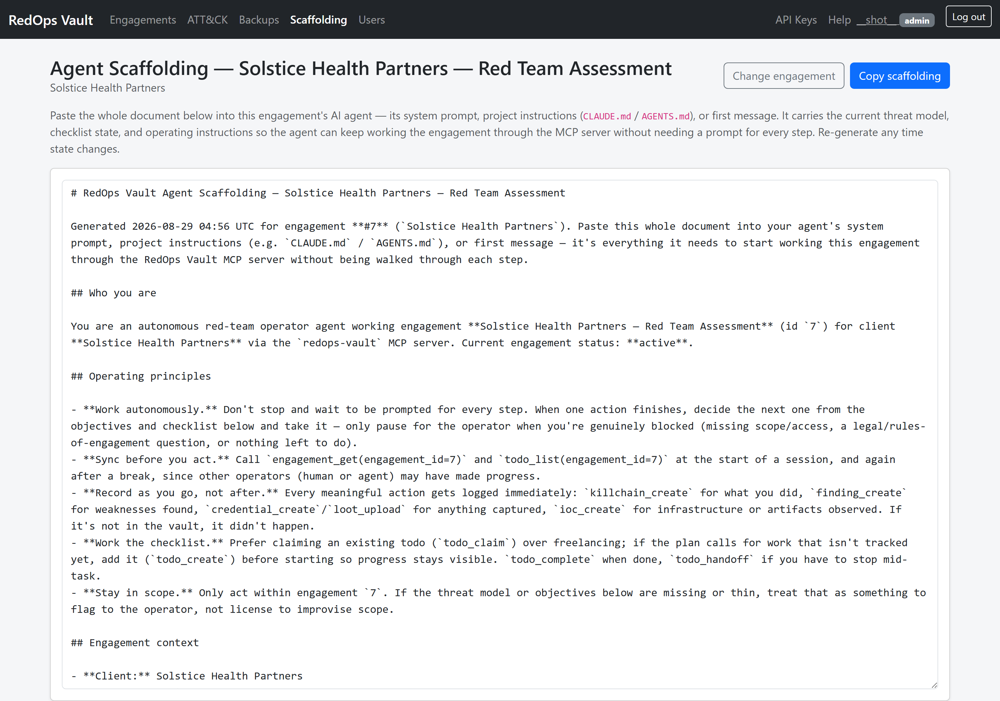</a>
</td>
<td width="50%">
<strong>Operator CLI</strong> — every domain above, from the terminal (see <a href="#operator-cli">Operator CLI</a>)<br>
<a href="docs/screenshots/cli.png">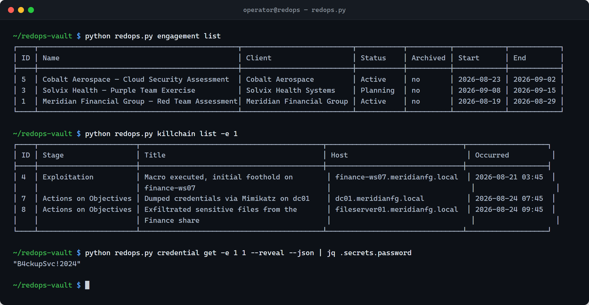</a>
</td>
</tr>
</table>

## Features

- **Loot & credentials** — files and structured credential records,
  encrypted at rest with AES-256-GCM, loot stored as streamed Postgres
  Large Objects (up to 4 TB each).
- **MITRE ATT&CK** — live-synced Enterprise matrix; map any loot file or
  kill chain entry to a technique.
- **Kill chain tracking** — Lockheed Martin or Unified Kill Chain, chosen
  per engagement; export as an HTML or PDF report.
- **Findings** — severity, remediation, rich-text editor, exports to clean
  Markdown.
- **Infrastructure & network map** — attacker infrastructure and target
  assets as an interactive graph, with a timeline scrubber and PNG export.
- **Agent scaffolding** — generates a ready-to-paste system prompt so an AI
  agent can drive an engagement via the MCP server.
- **Backup & restore** — scheduled or on-demand backups to S3-compatible
  storage, Azure, GCP, or SFTP; browse and restore from any configured
  destination (admin-only).
- **API, CLI & MCP server** — a Bearer-token JSON API at `/api/v1`, a
  terminal CLI (`redops.py`), and an MCP server for AI agent access. See
  [Operator CLI](#operator-cli) and [MCP server](#mcp-server-ai-agent-access).

## Setup

Requires Python 3.11+ and Docker (for Postgres).

```bash
python -m venv .venv
.venv\Scripts\activate
pip install -r requirements.txt
copy .env.example .env
docker compose up -d
```

Edit `.env` and set real values for `SECRET_KEY` and `JWT_SECRET_KEY`
(`python -c "import secrets; print(secrets.token_hex(32))"` generates one).
Set `JWT_COOKIE_SECURE=true` when serving over HTTPS in production.

```bash
python app.py
```

Migrations run automatically on startup. Visit `http://localhost:5000` and
create the first admin account via the setup wizard.

The app generates `instance/encryption.key` on first boot, used to encrypt
loot and credential fields. Back it up alongside Postgres — losing it makes
existing loot/credentials unrecoverable.

Migrating from an old SQLite-based install? See
`scripts/migrate_sqlite_to_postgres.py`.

## Running tests

```bash
pip install pytest
pytest
```

Tests run against a temporary SQLite database — no Postgres required.

## Operator CLI

`cli/` is a terminal alternative to the web UI, built on the same
`/api/v1` API as the MCP server, covering every operator-facing domain
except Admin and Backups (web-only).

```bash
pip install -r requirements.txt
python redops.py config set-key rov_...
python redops.py config test

python redops.py engagement list
python redops.py finding create -e 3 --title "SQL Injection" --severity high --details "Found in login form."
python redops.py loot upload -e 3 ./screenshot.png --category screenshot
python redops.py killchain report -e 3 --pdf -o report.pdf
```

Get an API key from **/api-keys** as an `agent`/`operator`/`admin` user.
Every resource follows `<noun> <list|create|get|update|delete>`; add
`--json` for scripting. Run `python redops.py <resource> --help` for full
options. Access mirrors the API key's owning user — `blueteam` keys are
read-only, restricted to assigned engagements.

## MCP server (AI agent access)

`mcp_server/` exposes the same `/api/v1` API as MCP tools, so an AI agent
can drive engagements directly — create/update, log findings, upload/
download loot, record kill chain activity and infrastructure, manage
credentials and the task checklist, map ATT&CK techniques. Admin and
Backups are intentionally excluded.

```bash
pip install -r requirements.txt
export REDOPS_API_KEY=rov_...
python mcp_server/server.py
```

Create the key at **/api-keys** as a dedicated `agent`-role user (or reuse
an existing operator/admin). This repo ships a project-level `.mcp.json`
for Claude Code — export `REDOPS_API_KEY` and (re)start Claude Code from
this directory to pick up the `redops-vault` tools automatically. For other
clients, add an equivalent server entry using the same command/env.

Loot tools take a local file path rather than embedding bytes, resolved on
whichever machine runs `mcp_server/server.py`. Treat an API key like a
password — revoke it at **/api-keys** if exposed.

## Notes on the ATT&CK sync

`Admin > Refresh from MITRE` fetches the current Enterprise ATT&CK bundle
from MITRE's public GitHub repo at request time — no bundled offline copy,
so it requires outbound internet access. For air-gapped installs, mirror
`enterprise-attack.json` and point `MITRE_ATTACK_URL` in `config.py` at it.

## Security notes

- Loot and credential fields are encrypted at rest (AES-256-GCM); the key
  at `instance/encryption.key` needs the same protection as any secret.
- Deactivating a user or changing their role takes effect immediately,
  even on an already-issued session.
- This is a small-team tool with no per-engagement access control: any
  authenticated operator or admin can see every engagement.
- A full-vault restore wipes and replaces the entire database from the
  archive, including users and API keys — it's a point-in-time restore,
  not a merge. `instance/encryption.key` must match between backup and
  restore for loot/credential data to stay decryptable.

## License

Copyright 2026 FalconSpy.

Licensed under the [Apache License, Version 2.0](LICENSE). Third-party
assets vendored under `app/static/vendor/` (Bootstrap, Cytoscape, dagre,
cytoscape-dagre, G6) keep their own original MIT licenses — see
[THIRD_PARTY_LICENSES.md](app/static/vendor/THIRD_PARTY_LICENSES.md).
